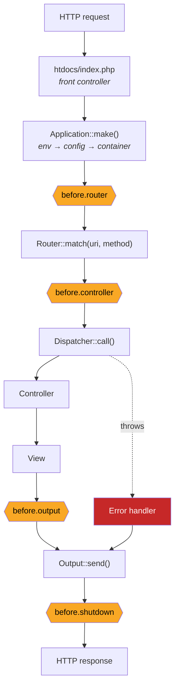
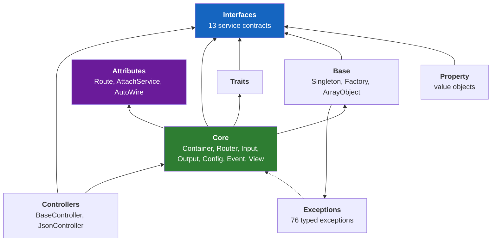

# Orange Framework

A small PHP 8.4 MVC framework and reference application, built to demonstrate how professional PHP frameworks are designed — not to compete with them.

Orange is roughly 13,000 lines of framework core across 13 service interfaces, surrounded by 26 independently versioned packages and an example application. Every package passes PSR-12 linting, PHPStan level 8, and Rector's dead-code analysis with zero findings, backed by 581 framework unit tests.

**This is a portfolio and reference codebase.** It has powered production sites, but its purpose today is to make architectural reasoning legible: why a service container resolves the way it does, why routing is declared next to the handler, why the request lifecycle exposes the hooks it does. Where a decision has a cost, this document says so.

---

## Table of contents

- [Project overview](#project-overview)
- [Goals](#goals)
- [Why this framework exists](#why-this-framework-exists)
- [Architecture](#architecture)
- [Key design decisions](#key-design-decisions)
- [Framework features](#framework-features)
- [Best practices implemented](#best-practices-implemented)
- [Modern PHP features used](#modern-php-features-used)
- [Testing and quality gates](#testing-and-quality-gates)
- [Comparison to enterprise frameworks](#comparison-to-enterprise-frameworks)
- [What this demonstrates](#what-this-demonstrates)
- [Skills demonstrated](#skills-demonstrated)
- [Quick start](#quick-start)
- [Further reading](#further-reading)
- [License](#license)

---

## Project overview

Orange is a front-controller MVC framework with a dependency injection container, attribute-driven routing, a priority-ordered event pipeline, cascading configuration, and a plain-PHP view layer. It ships as a Composer package (`orange/framework`) with no required runtime dependencies beyond PHP 8.4 itself.

The repository you are reading is the **application** side: a small HMVC-structured app that exercises the framework through a JSON REST API and a conventional HTML module.

| | |
| --- | --- |
| **Framework core** | ~13,200 LOC, 13 service interfaces, 581 unit tests |
| **Package ecosystem** | 26 satellite packages (~20,900 LOC) — validation, DTOs, ACL, auth, models, caching, view engines |
| **Example application** | ~3,200 LOC across 3 modules, 67 unit tests |
| **Static analysis** | PHPStan level 8, zero errors across all 27 packages |
| **Coding standard** | PSR-12, enforced by PHP_CodeSniffer |
| **PHP floor** | 8.4 |

---

## Goals

The project optimizes for a specific set of outcomes, and it trades other things away to get them.

1. **Make the framework's mechanics readable.** Every core service is a single file you can read in one sitting. `Container.php` is 614 lines; `Router.php` is 609. Someone evaluating this code should be able to answer "how does routing actually work here?" without a debugger.
2. **Demonstrate architectural boundaries, not just working code.** Layer dependencies are declared as rules in [`deptrac.yaml`](vendor/orange/framework/deptrac.yaml), not left implicit.
3. **Keep the core dependency-free.** `orange/framework` requires `php: >=8.4` and nothing else. Everything optional — caching, ORM-ish models, template engines — lives in a separate package the application opts into.
4. **Make correctness verifiable.** Static analysis, coding standards, dead-code detection, and unit tests all run from one command and all must pass before a change is considered done.
5. **Prefer explicit over magic.** Where the framework does use reflection or attributes, the mechanism is confined to one obvious place and documented at the point of use.

---

## Why this framework exists

Writing a framework is a well-worn way to learn what frameworks actually do, but the learning only sticks if you have to resolve the hard parts yourself: circular service dependencies, route resolution ordering, and config cascading across environments.

Orange exists to work through those problems in full rather than in outline. Two examples of that showing up in the code:

- **Service resolution ordering.** Registering services as closures means nothing is constructed until something asks for it. The application's `pdo` service ([`config/services.php`](config/services.php)) opens no database connection on a request that does not touch the database. This is a two-line design decision with real consequences for request latency, and it is the reason services are closures rather than instances.
- **Development-vs-production routing.** Attribute-based routing requires scanning the filesystem and reflecting over classes. That is fine at development speed and unacceptable per-request in production. Orange resolves this by scanning live in development and pre-generating a plain array for production — see [Key design decisions](#key-design-decisions).
Setting a PHP 8.4 floor rather than supporting older runtimes is a deliberate part of this. The point is to demonstrate current practice, not maximum compatibility.

---

## Architecture

### Request lifecycle

Every request enters through a single front controller, [`htdocs/index.php`](htdocs/index.php), which does almost nothing itself — it defines the root path, loads Composer's autoloader, and hands off:

```php
Application::make([...], [__ROOT__ . '/config'])->http();
```

`Application::http()` then runs a fixed pipeline, firing an event before each stage:



The four amber nodes are the extension points. Application code registers listeners in [`config/event.php`](config/event.php) without touching the framework.

### Layered dependencies

The framework's internal layering is not a convention in a style guide — it is a machine-checkable ruleset in [`deptrac.yaml`](vendor/orange/framework/deptrac.yaml). Interfaces may not depend on implementations. Exceptions carry messages and nothing else. Traits and base classes may not reach into core services.



The one deliberate exception is documented in the ruleset itself: every framework exception extends `OrangeException`, whose `decorate(Error $error)` hook is the single legitimate reason for the exception layer to reference core. Rather than loosen the rule for all of core, `Error.php` is split into its own layer so the allowance is exactly one class wide. That kind of narrow, justified exception is the point of declaring the rules at all.

### HMVC module layout

Each PSR-4 root in [`composer.json`](composer.json) is a self-contained module with its own controllers and views:

```text
api/                       # module: JSON REST API
├── controllers/
│   ├── RestController.php
│   └── WelcomeController.php
└── models/
    ├── RecordDto.php      # attribute-driven DTO
    └── RecordModel.php

application/
└── welcome/               # nested sub-module — HMVC nesting is arbitrary
    ├── controllers/
    └── views/
        ├── main/
        └── partials/
```

Modules depend on shared services (router, view, data) but never on each other's controllers or views. Adding one is three steps: create the folder, add a PSR-4 entry, register its path with the route detector.

---

## Key design decisions

This section is the substance of the project. Each decision below has a cost, and the cost is stated.

### 1. Services are closures, resolved lazily

**Decision.** The container stores service definitions, not service instances. A closure runs the first time the service is requested and if a singleton never again.

```php
// config/services.php
return [
    'pdo' => function () {
        // create only the 1st time called and not before
        $env = env('db');
        return new PDO($dsn, $user, $pass, [
            PDO::ATTR_ERRMODE            => PDO::ERRMODE_EXCEPTION,
            PDO::ATTR_EMULATE_PREPARES   => false,  // genuine native prepared statements
        ]);
    },
    'RecordModel' => fn(ContainerInterface $c): RecordModel => RecordModel::getInstance($c->pdo),
];
```

**Why.** A request that renders a static page should not open a database connection, start a session, or build a cache client. Lazy resolution makes that the default rather than something you have to remember. It also makes services trivially substitutable — a test swaps the closure, and every consumer gets the double with no other change.

### 2. The container supports seven binding types, including reflection-based autowiring

**Decision.** [`ContainerInterface`](vendor/orange/framework/src/interfaces/ContainerInterface.php) distinguishes `CLOSURE`, `ALIAS`, `VALUE`, `OBJECT`, `TYPE`, `REFERENCE`, and `AUTOWIRECLASS`. The last resolves a class's constructor arguments automatically via `ReflectionClass`.

**Why.** Autowiring is genuinely useful for application classes with unambiguous constructor dependencies. Explicit closures are better for anything with configuration, conditional wiring, or third-party constructors. Supporting both, and naming which is which at the registration site, keeps the convenience without making resolution unpredictable.

### 3. Routing is declared on the handler, compiled for production

**Decision.** Routes are PHP attributes on controller methods:

```php
class RestController extends JsonController
{
    #[Route('get', '/api/read/(\d+)', 'rest_read')]
    public function read(string $id): string
    {
        $record = $this->recordModel->read((int)$id);

        if (!$record instanceof RecordDto) {
            return $this->notFoundResponse('Record not found');
        }

        return $this->response(200, json_encode($record, $this->jsonFlags));
    }
}
```

In development, `RouterDetector::detect()` reflects over the module directories on each request and builds the route table. In production, `RouterDetector::export()` writes that same table once to `config/production/routes.php`, and the detector **refuses to run** outside development.

**Why.** Co-locating the route with its handler removes an entire category of bug — the route file that drifts out of sync with the controller. But a filesystem scan plus reflection per request is indefensible in production. Rather than pick one, the two modes produce identical route tables by construction, because the production file is generated by the same code path that would have run live.

**Related decision:** routes may be declared with a `url` and `name` but no callback. These are not routable — they exist only so `$router->getUrl('assets')` resolves a path centrally. No path in a view is ever hardcoded.

### 4. Cross-cutting concerns use a priority-ordered event pipeline, not PSR-15 middleware

**Decision.** The four lifecycle hooks (`before.router`, `before.controller`, `before.output`, `before.shutdown`) accept listeners with an explicit priority:

```php
// config/event.php
return [
    'before.output' => [
        [\app\libraries\OutputCors::class . '::handleCors', Event::PRIORITY_HIGHEST],
        [\app\libraries\Middleware::class . '::afterController'],
    ],
];
```

**Why.** An event pipeline is simpler to reason about than a nested middleware stack, and priority-ordered listeners cover the majority of what middleware is used for — CORS headers, authentication gates, response transformation, logging.

### 5. Controllers declare dependencies as annotated properties

**Decision.** `#[AttachService('name')]` on a typed property pulls that service from the container. There is no controller constructor.

```php
class RestController extends JsonController
{
    #[AttachService('RecordModel')]
    protected RecordModel $recordModel;
}
```

**Why.** Controllers in a web framework tend to want four to six services, and threading those through a constructor produces signatures that change every time a controller grows a feature. The attribute keeps the dependency explicit and typed while leaving the constructor free.

### 6. Configuration cascades by environment, in plain PHP

**Decision.** `config/*.php` files return arrays. `ENVIRONMENT=production` adds `config/production/` to the search path; files there override the base by key.

**Why.** Plain PHP arrays need no parser, no cache layer, and no custom syntax — and they can hold closures, which is what makes the service definitions above possible. The environment overlay is a search-path concern, so it costs nothing at runtime beyond one extra directory in the list.

Secrets stay out of source control in `.env` (INI format, gitignored) and are read through a global `env('KEY', 'default')` helper.

### 7. Views are plain PHP with no template language

**Decision.** `render('main/index')` locates `main/index.php` on the view search path, `extract()`s the data service into scope, and `require`s it. No compile step, no cache directory, no custom syntax.

**Why.** PHP is already a template language. Adding a second one buys escaping-by-default and a smaller surface for designers, at the cost of a compiler, a cache, and a debugging experience one step removed from the source.

### 8. Singletons inherit one implementation

**Decision.** Services that must be single-instance extend `orange\framework\base\Singleton`, which keys instances on `static::class` and exposes `newInstance()` as an explicit cache bypass.

**Why.** One implementation to indicate a singleton or factory service.

---

## Framework features

| Component | Implementation |
| --- | --- |
| **Front controller** | Single entry point; `Application` bootstraps env → config → container → lifecycle |
| **DI container** | 7 binding types, lazy closures, reflection autowiring, `ArrayAccess`-style and method access |
| **Router** | Regex route matching with capture-group arguments, named routes, reverse URL generation via `getUrl()`, attribute-driven discovery |
| **Dispatcher** | Instantiates the matched controller and invokes the method with positional route arguments |
| **Request** | `Input` service — normalized GET/POST/JSON body, headers, method, URI |
| **Response** | `Output` service — buffered body, header management, response codes, content-type negotiation, CORS, redirects |
| **Events** | Priority-ordered listeners on four lifecycle hooks; register/unregister at runtime |
| **Config** | Cascading multi-directory search path with environment overlays |
| **Views** | Plain-PHP renderer with a search-path resolver; pluggable via `ViewInterface` |
| **Logging** | PSR-3 `LoggerInterface` implementation with a pluggable handler (Monolog in the example app) |
| **Errors** | Centralized handler; 76 typed exceptions organized by domain (http, filesystem, container, router, …) |
| **CLI** | `Application::cli()` returns the built container for console entry points |

Beyond the core, the ecosystem provides validation, attribute-driven DTOs, ACL and authentication, PDO models with a query builder, caching, sessions, and two alternative view engines — each a separately versioned package the application opts into.

---

## Best practices implemented

**Separation of concerns.** Routing knows nothing about controllers beyond a callable reference. Controllers know nothing about how output is transmitted. The view layer receives data and returns a string. Each boundary is a typed interface, and the boundaries are machine-checked by Deptrac.

**Dependency inversion.** All 13 core services are consumed through interfaces. `ViewInterface` is the clearest payoff: three separate implementations (plain PHP, Handlebars, Lex-style merge) are drop-in substitutes because nothing depends on the concrete class.

**Interface segregation.** Contracts are per-service and small. There is no `FrameworkInterface` that everything must satisfy.

**Single responsibility, measured against file size.** No core service exceeds 700 lines. When `Application.php` began accumulating unrelated bootstrap work, the extension points (`preContainer()`, `postContainer()`) were extracted so applications could hook in without the class growing.

**Open/closed in practice.** Adding CORS handling, authentication, or response transformation requires registering an event listener — no framework file changes. Adding a module requires no framework changes. Replacing the view engine requires no framework changes.

**Fail fast, fail typed.** The framework defines 76 exceptions organized by domain rather than reaching for `\Exception` — `ServiceNotFound`, `RouteNotFound`, `ConfigFileDidNotReturnAnArray`, `FailedToAutoWire`. Callers can catch precisely what they intend to handle. The JSON controller sets `JSON_THROW_ON_ERROR` so an encoding failure raises at the source instead of returning `false` and failing a string return type somewhere unrelated.

**Secure defaults.** PDO is configured with `ATTR_EMULATE_PREPARES => false` for genuine native prepared statements. The document root is `htdocs/`; config, `.env`, and `vendor/` all sit above it and are unreachable over HTTP. JSON output uses hex-escaping flags for tags, quotes, and ampersands.

**Comments explain why, not what.** The codebase's convention is that a comment earns its place by recording a decision or a non-obvious constraint. From `JsonController`:

```php
// JSON_THROW_ON_ERROR: an encode failure raises JsonException at the
// source instead of json_encode() returning false and the string
// return type failing somewhere far from the cause
```

---

## Modern PHP features used

Verified counts across the framework and package ecosystem:

| Feature | PHP | Usage |
| --- | --- | --- |
| **Constructor property promotion** | 8.0 | 86 constructors |
| **Attributes** | 8.0 | `#[Route]`, `#[AttachService]`, `#[AutoWire]`, plus 107 DTO attributes (75 validations, 32 filters) |
| **`match` expressions** | 8.0 | 13 sites, including the container's binding-type dispatch |
| **`readonly` properties** | 8.1 | 44 declarations |
| **Enums** | 8.1 | `AuthError` |
| **First-class callable syntax** | 8.1 | 28 sites — e.g. `$this->merge->pluginCallBackHandler(...)` passed as a `Closure` rather than an array callable |
| **`#[\Override]`** | 8.3 | 43 declarations |
| **Asymmetric visibility** | 8.4 | 15 DTO properties — `public protected(set)` gives public reads with writes confined to the class |
| **`array_all()` / `array_any()`** | 8.4 | `Collector::has()` / `hasOne()` |

`declare(strict_types=1)` is present in every source file. The asymmetric-visibility usage is the most load-bearing: DTOs are immutable to consumers without the boilerplate of a getter per property, and without the runtime cost of a `__get()` interceptor.

```php
class RecordDto extends Dto
{
    // filters run in declaration order and later rules see the filtered
    // value, so the hygiene filters come first — '   ' fails IsRequired
    #[Trim()]
    #[StripControlChars()]
    #[CollapseSpaces()]
    #[IsRequired()]
    #[MaxLength(64)]
    #[FieldName('name')]
    public protected(set) string $name;
}
```

---

## Testing and quality gates

Four gates run on every change, in a fixed order, stopping at the first failure ([`sweep.sh`](sweep.sh)):

```bash
composer lint:fix      # phpcs/phpcbf — PSR-12
composer rector:fix    # dead-code and modernization refactorings
composer type-check    # PHPStan level 8
composer test          # PHPUnit
```

| Gate | Result |
| --- | --- |
| PSR-12 (PHP_CodeSniffer) | 27/27 packages clean |
| PHPStan level 8 | 27/27 packages, zero errors |
| Rector (dead code, PHP 8.4 target) | 27/27 packages, no changes proposed |
| Framework unit tests | 581 tests, 1,097 assertions |
| Application unit tests | 67 tests, 314 assertions |

The three tools are deliberately non-overlapping: PHPCS owns formatting, PHPStan owns types, Rector owns dead code and modernization. Rector is configured with no style rules specifically so it cannot fight PHPCS.

**On suppressions.** PHPStan carries exactly two `ignoreErrors` entries, both documented in [`phpstan.neon`](phpstan.neon): container access through `__get()`, and `RouterDetector`'s environment branches, which look statically unreachable only because the analysis bootstrap fixes `ENVIRONMENT` to one literal.
**Test design.** Each test builds fresh service instances and registers them on the container in `setUp()`, so no state crosses test boundaries. This is what `newInstance()` exists for. Test helpers (`callMethod()`, `getPrivatePublic()`) live in a shared `orange/testkit` package
Deptrac (architectural layer rules) and Infection (mutation testing) are configured in the framework package but are not yet part of the automated sweep.

---

## Comparison to enterprise frameworks

Orange is not a Laravel or Symfony alternative, and choosing it for a commercial project over either would be difficult to justify.

**What the comparison is meant to show:** the concepts that make the large frameworks work — inversion of control, a resolvable service graph, a front-controller lifecycle with extension points, environment-aware configuration, contract-based substitution, a build step for anything too expensive to compute per request — are all present here, implemented from scratch, and small enough to read.

---

## What this demonstrates

For a reviewer evaluating this as work product, these are the claims the code supports:

**Architectural reasoning under constraint.** The development-versus-production routing split is the clearest example: a feature that is desirable for developer experience and unacceptable for production performance, resolved by generating the fast path from the same code that produces the convenient one. That is the same reasoning behind Symfony's compiled container, arrived at independently and for the same reason.

**Treating quality tooling as design, not decoration.** Three analyzers with deliberately non-overlapping responsibilities. Layer boundaries expressed as an executable ruleset with one narrowly scoped exception — and the exception implemented by splitting a class into its own layer rather than by relaxing the rule.

**Working at package scale.** Twenty-six independently versioned repositories with a shared quality bar, a private Composer index, and one command that reports the state of all of them. The `orange/testkit` test helper published package — is ordinary maintenance work done properly.

---

## Skills demonstrated

**Architecture and design** — MVC and HMVC, dependency injection and IoC, service container design with reflection autowiring, front-controller request lifecycle, event-driven extension points, layered architecture with enforced boundaries, interface-driven substitution, SOLID applied where it earns its keep.

**Modern PHP** — PHP 8.0 through 8.4 features in production use, attributes as a first-class design tool, `strict_types` throughout, reflection API, `Closure` binding and first-class callables, PSR-4 autoloading, PSR-12 compliance, PSR-3 logging.

**Engineering practice** — static analysis at level 8 with no baseline, coding-standard enforcement, automated refactoring, unit testing with isolated fixtures, mutation-testing and architecture-testing configuration, multi-repository maintenance, Composer package authoring and private registry publishing.

**Operations** — Docker and Docker Compose, FrankenPHP/Caddy, TLS termination, environment-based configuration, deployment build steps.

**Communication** — ~3,000 lines of guides in [`getting started with orange/`](getting%20started%20with%20orange/).

---

## Quick start

### Docker (recommended)

```bash
git clone https://github.com/ProjectOrangeBox/Orange-Application.git webapp
cd webapp
docker compose up -d --build
```

Serves at `http://localhost:8080` and `https://localhost:8443`. The entrypoint creates the writable `var/` directories, seeds `.env` from [`env.sample`](env.sample), and runs `composer install` on first start. The repository is mounted into the container, so code edits are live — only Dockerfile or dependency changes need a rebuild.

The image runs [FrankenPHP](https://frankenphp.dev/) (PHP 8.4 with an embedded Caddy server). Every request is served by a fresh PHP process. `ENVIRONMENT` in `.env` is read once at startup and decides how aggressively the container caches:

| `ENVIRONMENT` | Behavior |
| --- | --- |
| `development` (or anything but `production`) | opcache revalidates per request, so edits appear on reload; dev dependencies installed |
| `production` | opcache stops checking timestamps and dev dependencies are skipped; restart the container to pick up a deploy |

### Without Docker

```bash
composer install
cp env.sample .env
mkdir -p var/{logs,cache,uploads,downloads,temp,working} && chmod -R 777 var
php -S 127.0.0.1:8000 -t htdocs
```

Any web server works, subject to two rules: the document root must be `htdocs/`, and every request that is not a real file must route to `htdocs/index.php`. Apache configuration is in [`htdocs/.htaccess`](htdocs/.htaccess); the FrankenPHP/Caddy configuration is in [`Caddyfile`](Caddyfile).

### Database schema and migrations

The schema is defined as [Phinx](https://phinx.org) migrations in [`database/migrations/`](database/migrations/), with example data in [`database/seeds/`](database/seeds/). Phinx is a `require-dev` dependency — migrations are a development and deployment tool, and the production image installs with `--no-dev`.

```bash
composer db:migrate    # apply pending migrations
composer db:seed       # load the example data
composer db:export     # regenerate the sandbox's initdb SQL from both
composer db:check      # fail if that SQL no longer matches the migrations
```

Connection details come from `.env`'s `[db]` section via [`phinx.php`](phinx.php) — there is no second copy to keep in step. That file also falls back to `127.0.0.1` when the configured host does not resolve, because `.env` says `host.docker.internal` (how the app container reaches MySQL) and phinx is usually run from the host, where that name means nothing.

#### What the migrations create

| Migration | Tables | Notes |
| --- | --- | --- |
| `…0001_create_acl_tables` | `orange_users`, `orange_roles`, `orange_permissions`, `orange_user_meta`, `orange_user_role`, `orange_role_permission` | The six tables [`orange/acl`](https://github.com/ProjectOrangeBox/acl) owns. Created in dependency order — the join tables carry foreign keys. Index and constraint names match that package's own DDL, since the tables belong to it. |
| `…0002_create_records` | `records` | Behind the flat REST + Vue example. `in_office` is a real boolean to the domain and an int to the database. |
| `…0003_create_calendar_events` | `calendar_events` | The column is `event_date` while the DTO property is `date` — see the `#[Column]` attribute on `CalendarEventDto`. |
| `…0004_create_orders` | `customers`, `orders`, `order_lines` | The nested-DTO example. Money is `DECIMAL(10,2)`, never a float. Deleting an order takes its lines with it (`CASCADE`); deleting a customer with orders is refused (`RESTRICT`). |

#### What the seeds provide

| Seeder | Gives you |
| --- | --- |
| `AclSeeder` | An `admin` (`admin@example.com` / `orange123`) holding `orders.create`, `orders.update` and `orders.delete`, and a `guest` |
| `RecordsSeeder` | Three sample records, so the list renders with something in it |
| `OrdersSeeder` | Two customers and two orders with three line items between them |

**The guest row is not decoration.** `orange/acl` resolves every request without a login to the id in its `guest user` config (2 by default), so if that row is missing, every anonymous request *fails* rather than simply being unprivileged. It is seeded inactive with no usable password hash — an identity to fall back to, not an account anyone logs into.

The admin password is a published example credential. It is not a secret, and nothing reachable should be running it.

#### Two forms, one source

The mysql sandbox's `initdb/*.sql` is **generated** from these migrations, not maintained alongside them. `composer db:export` builds a scratch database, migrates and seeds it, dumps the result into the sandbox repo, and drops it. Migrations serve anyone developing against the schema; the plain SQL serves anyone loading it into their own MySQL; and neither can drift, because one is made from the other. `composer db:check` fails when they disagree.

Loading it into your own server needs no PHP at all — the files are plain SQL in numeric order, with schema and seed data split so you can take the structure without the example rows:

```bash
for f in ../mysql/initdb/*.sql; do mysql yourdb < "$f"; done
```

`db:export` needs an account that may `CREATE DATABASE` — the app user is deliberately granted only its own schema. It reads the sandbox's root password when that repo is checked out beside this one, or takes `DB_EXPORT_USER` / `DB_EXPORT_PASS`.

### Authentication, and the mail it sends

Sign in at **<http://localhost:8080/login>** with the seeded `admin@example.com`
/ `orange123`, which lands on `/dashboard` — a page whose only content is a live
`$user->can(...)` against [`orange/acl`](https://github.com/ProjectOrangeBox/acl)
for each of the three permissions the orders API guards its writes with. The page
and the endpoint cannot disagree, because neither of them decides it.

The browser flow (`application/login/`) and the JSON one (`POST /api/login`)
deliberately share one implementation of everything that matters: the same
`orange/auth`, the same acl user, and the same login throttle — an endpoint that
counted failures less would simply be the one an attacker scripts. What differs
is only what a browser needs, a CSRF token and a redirect instead of a status
code.

**Mail goes to a container, not to anyone.** The mail sandbox below runs
[Mailpit](https://mailpit.axllent.org/): an SMTP server that accepts every
message and delivers none of them, which is what makes it safe to develop
against a database full of real-looking addresses. Everything the app sends is
readable at **<http://localhost:8025>**, links included. The app needs it only
when it actually sends something — nothing else in the application touches it.

Sending is [`orange/mail`](https://github.com/ProjectOrangeBox/mail) — a message
that validates itself over a thin `symfony/mailer` transport, plus a collector
that keeps mail instead of sending it so the unit suite never opens a socket.
**[Its README](vendor/orange/mail/README.md) is the reference**: configuration,
the DSN, the collector, and a step-by-step walkthrough of reading a message in
Mailpit and clicking the link inside it. Configuration for this app lives in
`.env`'s `[mail]` section, documented in [`env.sample`](env.sample).

### Supporting containers

The app itself needs none of these to boot — the welcome page, routing, views and the container all work with nothing but the webapp running. They exist so the code paths that *do* need a server can be exercised locally instead of mocked, and so the matching test suites run for real rather than skipping.

Each is a separate repo holding one `docker-compose.yml`. Clone whichever you need and `docker compose up -d`:

| Container | Repo | Port | Used by |
| --- | --- | --- | --- |
| MySQL 8.4 | [mysql-sandbox](https://github.com/ProjectOrangeBox/mysql-sandbox) | `3306` | the `[db]` section of `.env`; anything model-layer |
| Redis 8 | [redis-sandbox](https://github.com/ProjectOrangeBox/redis-sandbox) | `6379` | [`orange/cache`](https://github.com/ProjectOrangeBox/cache)'s `RedisCache` |
| Memcached 1.6 | [memcached-sandbox](https://github.com/ProjectOrangeBox/memcached-sandbox) | `11211` | [`orange/cache`](https://github.com/ProjectOrangeBox/cache)'s `MemcachedCache` |
| Mailpit | [mail-sandbox](https://github.com/ProjectOrangeBox/mail-sandbox) | `1025` SMTP, `8025` UI | the `[mail]` section of `.env`; [`orange/mail`](https://github.com/ProjectOrangeBox/mail) |

The two cache containers and the mail one are deliberately configured as **sandboxes** — no password, no persistence, safe to wipe. That is not a shortcut: `orange/cache`'s suite flushes the entire server before and after every test, so it must never be pointed at a server holding anything real, and a mailbox that survives a restart is how you end up debugging a bug you already fixed from last week's message. MySQL is the exception and does persist, in a named volume, since a database that forgets its schema on restart is no use.

**Host addressing differs by where PHP runs.** All three publish their port to the host, so they are reachable at `host.docker.internal` from inside the webapp container and `127.0.0.1` from a CLI script or a local `php -S`. The cache test suite probes both and uses whichever answers, so it needs no configuration either way.

A suite whose server is absent **skips rather than fails**, naming the container to start — so a clean checkout with no Docker still gives a green run. It just proves less, which is why the skip count is worth reading and not only the exit code.

### Running the checks

```bash
composer test          # application tests
composer test:orange   # framework core tests
composer type-check    # PHPStan level 8
composer lint          # PSR-12
./sweep.sh             # all four, in order, stopping at first failure
```

Each `vendor/orange/*` package carries the same four gates and is checked on its own, from its own directory — so its `phpcs.xml`, `phpstan.neon` and `rector.php` apply rather than the app's:

```bash
cd vendor/orange/cache
./sweep.sh                                  # that package's full gauntlet
cd unittest && sh runUnitTests.sh           # just its tests
cd unittest && sh runUnitTests.sh RedisCacheTest   # one test file
```

The packages are developed in place as git clones (a `--prefer-source` install), so a fix goes in, gets swept, and is committed in that package's own repository.

### Optional libraries

Neither of these is required and neither is installed. They are worth knowing about because the
framework is built to accept the first and deliberately leaves the second to you.

**Monolog** — the framework's own logger writes to a file and that is all it does. `Log`
implements PSR-3 `LoggerInterface`, and `config/log.php` takes a `handler` key that accepts *any*
PSR-3 logger; supply one and the framework stops writing files and forwards every call to it
instead. That is the seam to reach for as soon as logs need to go somewhere a file cannot —
syslog, Slack, Sentry, a rotating set, or several at once.

```bash
composer require monolog/monolog
```

```php
// config/log.php
use orange\framework\interfaces\LogInterface;
use Monolog\Logger;
use Monolog\Handler\StreamHandler;

$monolog = new Logger('app');
$monolog->pushHandler(new StreamHandler(__ROOT__ . '/var/logs/app.log', Logger::DEBUG));

return [
    'threshold' => LogInterface::ALL,
    'handler' => $monolog,   // must implement Psr\Log\LoggerInterface
];
```

A handler that is not an object throws `InvalidValue`; one that is an object but not PSR-3 throws
`IncorrectInterface`. With a handler set, `filepath` is no longer required to be writable — the
handler owns its own storage.

**Carbon** — there is no date/time abstraction anywhere in the framework, by choice: PHP's own
`DateTimeImmutable` covers most of what an application needs. Carbon is worth adding when the
application itself does real calendar work — relative phrasing ("3 days ago"), fluent arithmetic,
localized formatting, or timezone juggling — none of which is the framework's business.

```bash
composer require nesbot/carbon
```

```php
use Carbon\Carbon;

$due = Carbon::parse($record->out_until);

$this->data['out_until_human'] = $due->diffForHumans();      // "in 3 days"
$this->data['is_overdue']      = $due->isPast();
```

Both were previously required by this application and used by neither, so they were removed. Add
them back when something actually calls for them.

---

## Further reading

- [`getting started with orange/`](getting%20started%20with%20orange/) — twelve guides covering the request lifecycle, routing, controllers, views, the container, configuration, HMVC modules, global helpers, error handling, and a build-a-module tutorial
- [`quickstart.md`](quickstart.md) — condensed walkthrough
- [`overview.md`](overview.md) — architecture notes

---

## License

MIT — see [`LICENSE`](LICENSE).
